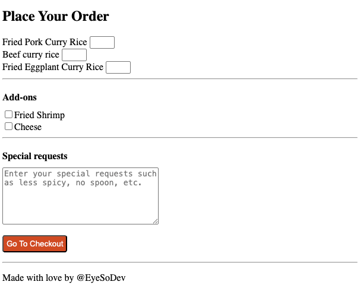

   
  <h1>The Final Project of HTML</h1>

 

Welcome to my final project "The Restaurant Menu".

## The restaurant Menu
I use all the skills, I learned from Codedex for create page for preview menu and place order.

# Skills
- Elements
- Strcture
- Forms
- Semantic HTML

# Results

  
  

 